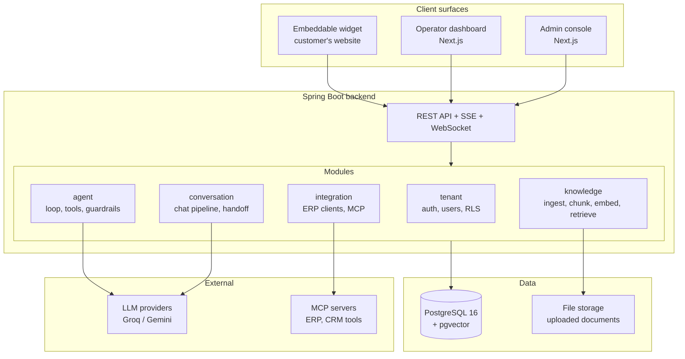
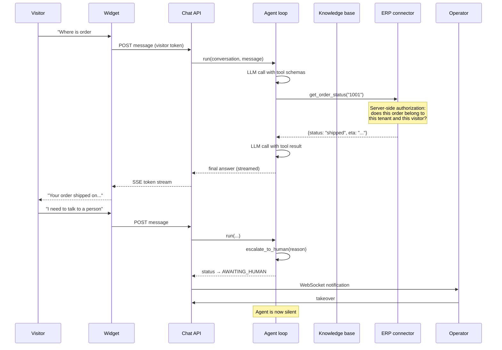

# OmniCare AI

**Multi-tenant B2B SaaS platform for ERP-connected, agentic customer support.**

OmniCare AI gives a business an AI support agent for its website. The agent answers from the company's own documents, calls the company's business systems to fetch live data, and hands the conversation to a human operator when it can't help.


---

## Table of contents

- [Why this exists](#why-this-exists)
- [What makes it different](#what-makes-it-different)
- [Architecture](#architecture)
- [How a conversation flows](#how-a-conversation-flows)
- [Tech stack](#tech-stack)
- [MVP scope](#mvp-scope)
- [Project structure](#project-structure)
- [Getting started](#getting-started)
- [Configuration](#configuration)
- [Database and migrations](#database-and-migrations)
- [Testing](#testing)
- [Engineering principles](#engineering-principles)
- [Roadmap](#roadmap)
- [Security notes](#security-notes)
- [Documentation](#documentation)
- [License](#license)

---

## Why this exists

Most support chatbots are FAQ lookups with a language model on top. They can tell a customer what the return policy says. They cannot tell that customer where *their* order is, because they have no connection to the systems that hold the answer.

That gap is where support tickets actually come from. "Where is my order?", "Was my invoice paid?", "Is this item in stock?" — every one of these needs live data from an ERP or CRM, and every one of them currently ends up in a human's queue.

OmniCare AI closes that gap. A business connects its knowledge base *and* its business systems, and the agent decides for itself which one to reach for.

## What makes it different

| | Typical support bot | OmniCare AI |
|---|---|---|
| Answer source | Static FAQ / scripted flows | RAG over the tenant's own documents, with citations |
| Live business data | None | Tool calls into ERP/CRM via a pluggable connector layer |
| Decision making | Intent classification | Agent loop — the model chooses tools, chains them, and stops when done |
| Escalation | Keyword trigger | Escalation is a tool the agent invokes when it recognises its own limits |
| Extending to a new system | Vendor roadmap | Write an MCP server; core code does not change |
| Languages | Per-language training | Multilingual answers from the LLM; retrieval uses a compact English-first embedding model (a multilingual embedding model is a post-MVP swap) |

The extension story is the architectural bet. Adding support for a new ERP means adding a connector — never editing the agent, the chat pipeline, or the retrieval layer.

## Architecture

A **modular monolith**. One deployable unit, with modules separated by enforced package boundaries so that any of them can be extracted into its own service later without a rewrite.



### Module boundaries

Each module is internally layered, and dependencies point inward:

```
api  →  application  →  domain
                ↑
        infrastructure
```

- `domain` — pure Java. No Spring, no JPA, no serialisation annotations. Business rules only.
- `application` — use cases and orchestration.
- `infrastructure` — JPA entities, repository implementations, HTTP clients.
- `api` — controllers and DTOs.

A module may depend on another module's `api` or `application` layer, never on its `infrastructure` or persistence entities. **ArchUnit tests enforce this in CI.**

## How a conversation flows



Two rules govern this flow and are not negotiable:

1. **The model decides *which* tool to call. The application decides whether that call is *allowed*.** Every tool execution runs an ownership and tenant-scope check in code before it touches data.
2. **Every agent run is bounded** — a maximum step count and a token budget. No unbounded loops, no runaway cost.

## Tech stack

### Backend

| Concern | Choice | Why |
|---|---|---|
| Language | Java 21 | Virtual threads suit an IO-bound agent loop |
| Framework | Spring Boot 3.x | Mature ecosystem, strong testing story |
| AI | Spring AI | Provider abstraction, local embeddings, MCP client |
| Database | PostgreSQL 16 + pgvector | Relational data and vectors in one store |
| Migrations | Flyway | Schema is versioned code, never generated by the ORM |
| Embeddings | Local ONNX `all-MiniLM-L6-v2` (384 dims) | No API cost, no rate limit, unlimited ingestion |
| LLM | Groq (primary), Google Gemini (fallback) | Free tiers with tool calling; both behind one interface |
| Realtime | SSE for chat, WebSocket/STOMP for operators | SSE is simpler for one-way token streaming |
| Resilience | Resilience4j | Timeouts, retries with backoff, circuit breakers |
| Testing | JUnit 5, AssertJ, Testcontainers, ArchUnit | Real Postgres in tests; boundaries enforced automatically |

### Frontend

| Concern | Choice |
|---|---|
| Dashboard | Next.js 15 (App Router), TypeScript, Tailwind, shadcn/ui |
| Data fetching | TanStack Query |
| Widget | Vanilla TypeScript in a Shadow DOM, bundled with esbuild |

The widget deliberately avoids a framework. It is injected into third-party sites, so bundle size and CSS isolation matter more than developer convenience.

### Infrastructure

| Concern | Choice |
|---|---|
| Containers | Docker, Docker Compose for local development |
| Deployment | Coolify on a VPS, nginx reverse proxy, Let's Encrypt |
| Frontend hosting | Vercel |
| CI | GitHub Actions |
| Error tracking | Sentry |

## MVP scope

The MVP is deliberately narrow. It exists to prove one demo end to end, not to be feature complete.

### In scope

- ✅ **Authentication and tenancy** — registration, JWT auth, one owner per tenant
- ✅ **Tenant isolation** — `tenant_id` on every table, enforced by Postgres Row Level Security
- ✅ **Streaming chat** — SSE token streaming, full conversation persistence
- ✅ **Knowledge base** — document upload, text extraction, chunking, local embeddings, vector retrieval with citations
- ✅ **Agent loop** — tool calling with a step budget, server-side tool authorization
- ✅ **ERP tool** — order lookup against a mock ERP service
- ✅ **Human handoff** — escalation tool, conversation state machine, live operator notification
- ✅ **Embeddable widget** — script tag install, Shadow DOM isolation, origin-scoped visitor tokens
- ✅ **Operator dashboard** — conversation list, live view, takeover

### Explicitly out of scope for the MVP

| Deferred | Reason |
|---|---|
| Voice support | Latency engineering is a project of its own |
| Subscription billing | No paying customers yet; plan limits are hardcoded |
| Team management and roles | A `role` column exists; there is no UI for it |
| Multiple LLM providers | The interface exists; only one implementation is wired |
| Tenant-supplied API keys | Encrypted key vault comes after the MVP |
| Hybrid search and reranking | Vector search alone is sufficient to prove the concept |
| Kafka and Redis | A single instance does not need them; a `jobs` table covers async work |
| Real ERP integration | A mock ERP proves the connector boundary |

Anything not in the current week's plan goes to `docs/backlog.md`, not into the code.

## Project structure

```
omnicare-ai/
├── backend/                       Spring Boot application
│   ├── src/main/java/com/omnicare/platform/
│   │   ├── tenant/                tenants, users, auth, tenant context
│   │   ├── conversation/          conversations, messages, chat pipeline, handoff
│   │   ├── knowledge/             documents, chunking, embeddings, retrieval
│   │   ├── agent/                 agent loop, tool registry, guardrails
│   │   ├── integration/           ERP clients, MCP client
│   │   └── shared/                configuration, error handling, cross-cutting
│   └── src/main/resources/
│       ├── application.yml
│       └── db/migration/          Flyway migrations
├── frontend/                      Next.js operator dashboard and admin console
├── widget/                        Embeddable chat widget
├── mock-erp/                      Mock ERP service for development
├── docs/
│   ├── adr/                       Architecture Decision Records
│   ├── prompts/                   Versioned system prompts
│   ├── mvp-5-week-plan.md         Day-by-day build plan
│   ├── journal.md                 Daily development log
│   └── backlog.md                 Deferred ideas
├── docker-compose.yml
├── CLAUDE.md                      Instructions for AI-assisted development
└── README.md
```

Within each module, `domain/`, `application/`, `infrastructure/` and `api/` follow the layering described above.

## Getting started

### Prerequisites

| Tool | Version | Check |
|---|---|---|
| JDK | 21 | `java -version` |
| Docker Desktop | latest, WSL2 backend on Windows | `docker --version` |
| Git | any recent | `git --version` |
| Node.js | 20+ (frontend and widget only) | `node --version` |

Maven is not required — the project uses the Maven Wrapper.

### 1. Clone

```bash
git clone https://github.com/<your-username>/omnicare-ai.git
cd omnicare-ai
```

On Windows, keep the clone path short (for example `C:\dev\omnicare-ai`) to avoid the 260-character path limit.

### 2. Start the database

```bash
docker compose up -d
docker compose ps        # wait for status: healthy
```

This starts PostgreSQL 16 with the pgvector extension on **port 5433**, with data persisted in a named volume.

### 3. Set environment variables

Copy the example file and fill in your keys:

```bash
cp .env.example .env
```

```powershell
Copy-Item .env.example .env
```

| Variable | Required | Notes |
|---|---|---|
| `DB_USER` | no | Defaults to `omnicare` |
| `DB_PASSWORD` | no | Defaults to `omnicare_dev` for local development |
| `JWT_SECRET` | yes | Any long random string for local use |
| `GROQ_API_KEY` | yes | Free key from the Groq console |
| `GEMINI_API_KEY` | no | Fallback provider |

Never commit `.env`. It is gitignored.

### 4. Run the backend

**macOS / Linux**

```bash
cd backend
./mvnw spring-boot:run
```

**Windows (PowerShell)**

```powershell
cd backend
.\mvnw.cmd spring-boot:run
```

### 5. Verify

```bash
curl -s localhost:8080/actuator/health
```

```powershell
curl.exe -s localhost:8080/actuator/health
```

Expected: `{"status":"UP"}`. This confirms the application started, the database is reachable, Flyway migrations ran, and Hibernate validated the schema against the entities.

### 6. Frontend and widget (from week 5)

```bash
cd frontend && npm install && npm run dev     # http://localhost:3000
cd widget   && npm install && npm run build   # emits widget.js
```

## Configuration

Configuration lives in `backend/src/main/resources/application.yml`. Three settings are deliberate and should not be changed casually:

| Setting | Value | Why |
|---|---|---|
| `spring.jpa.hibernate.ddl-auto` | `validate` | Flyway owns the schema. Hibernate only checks that entities match it, and fails fast at startup if they don't. |
| `spring.jpa.open-in-view` | `false` | Prevents a database connection being held for the whole HTTP request. Essential when responses stream for seconds. |
| `spring.datasource.hikari.maximum-pool-size` | `10` | Roughly `(cores × 2)`. A larger pool degrades throughput rather than improving it — Postgres uses one process per connection. |

All secrets are read from environment variables with development defaults, so nothing sensitive lives in the repository.

## Database and migrations

Flyway runs on startup and applies any migration in `backend/src/main/resources/db/migration` that is not yet recorded in `flyway_schema_history`.

```
V1__baseline.sql          extensions: pgcrypto, vector
V2__core_tables.sql       tenants, users, conversations, messages, documents
V3__rls.sql               row level security policies
V4__jobs.sql              async job queue
V5__chunks.sql            document chunks with vector(384) embeddings
V6__hnsw_index.sql        approximate nearest neighbour index
```

**Rules:**

- Migration files are immutable once applied. Flyway stores a checksum and fails on edits. Roll forward with a new file.
- Naming: `V<n>__snake_case_description.sql`.
- Any new table holding tenant data gets `tenant_id NOT NULL` **and its RLS policy in the same migration**, never in a follow-up.

Useful commands:

```bash
./mvnw flyway:info              # migration status
docker compose down             # stop, keep data
docker compose down -v          # stop and delete the volume — full reset
```

## Testing

```bash
./mvnw test        # unit and integration tests
./mvnw verify      # tests + ArchUnit boundary checks
```

| Layer | Approach |
|---|---|
| Domain logic | Plain JUnit, no Spring context |
| Algorithms (chunking, context windowing) | Test-first, including empty, single-element and oversized inputs |
| Persistence and API | Testcontainers with real PostgreSQL — not H2, because pgvector and RLS behave differently |
| Architecture | ArchUnit rules on module and layer dependencies |
| LLM-dependent code | A deterministic fake `LlmProvider`. CI never calls a real API |

Every tenant-scoped resource has a cross-tenant isolation test: a request authenticated as tenant A must not be able to read tenant B's data.

Docker Desktop must be running for the integration tests to pass.

## Engineering principles

These are enforced, not aspirational.

**Tenant isolation is the hardest constraint.** Every tenant-scoped table carries `tenant_id` with a Row Level Security policy. Queries also scope explicitly — RLS is the safety net, not the primary control. A cross-tenant leak would end this product, so it is treated as more important than any other rule here.

**The domain layer stays pure.** No framework annotations, no public setters. State changes happen through meaningful methods (`conversation.escalateToHuman(reason)`), and constructors reject invalid state.

**Abstractions exist where change is expected.** `LlmProvider`, `Tool` and `ErpClient` are interfaces because providers, tools and ERPs will change. Nothing else is abstracted speculatively.

**The LLM is never a security boundary.** It selects tools; the application authorises them. Retrieved documents and user messages are treated as data, never as instructions — prompt injection is assumed.

**Every external call is bounded.** Timeouts, retry with exponential backoff and jitter, and a circuit breaker. No infinite-timeout clients anywhere.

**Prompts are versioned artifacts** in `docs/prompts/`, not string literals scattered through services.

**Decisions are recorded.** Every architectural choice gets a one-page ADR in `docs/adr/` covering the decision, the alternatives considered, and the reasoning.

### Conventions

- **Commits:** Conventional Commits — `feat:`, `fix:`, `refactor:`, `test:`, `chore:`, `docs:`. One logical change per commit.
- **Branches:** `feat/<short-name>`, merged through a pull request even when working solo.
- **Line endings:** enforced by `.gitattributes`. `mvnw` must stay LF and executable or Linux CI will fail.

## Roadmap

### MVP — 5 weeks

| Week | Focus | Outcome |
|---|---|---|
| 1 | Foundation, domain model, auth, multi-tenancy | Proven tenant isolation, no AI yet |
| 2 | Chat pipeline and LLM integration | Real streaming AI conversation |
| 3 | Knowledge base and RAG | Answers grounded in uploaded documents, with citations |
| 4 | Agent loop, tools, human handoff | The agent chooses between knowledge, ERP and escalation |
| 5 | Widget, dashboard, deployment | Full demo running on a public URL |

The day-by-day breakdown lives in [`docs/mvp-5-week-plan.md`](docs/mvp-5-week-plan.md).

### After the MVP

Ordered by expected value:

1. **MCP client integration** — turn the mock ERP into an MCP server and connect through Spring AI's MCP client. The `Tool` abstraction already exists, so this is a connector change, not a core change.
2. **Hybrid search** — combine pgvector similarity with Postgres full-text search using reciprocal rank fusion. Vector search alone misses order numbers and product codes.
3. **Reranking** — a cross-encoder over the top 20 results. The single largest jump in answer quality.
4. **Tenant API key vault** — envelope encryption, keys never returned by any API.
5. **Additional LLM providers** — the interface is already in place.
6. **Subscription billing** — Paddle or Lemon Squeezy as merchant of record, with usage metering.
7. **Voice support** — speech to text, then text to speech over the existing agent pipeline.
8. **Analytics** — resolution rate, escalation rate, deflection, cost per conversation.
9. **Auto-close** — a resolution tool with a follow-up window.
10. **Observability** — OpenTelemetry traces and per-conversation LLM cost attribution.

## Security notes

- Passwords are hashed with BCrypt. Nothing sensitive is ever logged.
- Access tokens are short-lived; refresh tokens rotate.
- The widget receives a short-lived, origin-scoped visitor token. It never receives a tenant API key or a long-lived credential.
- Widget origins are validated against an allowlist per tenant.
- Uploads are validated by MIME type and size; filenames are never trusted.
- Tenant-supplied provider keys (post-MVP) use envelope encryption and are never returned by any endpoint — only the last four characters are ever displayed.
- LLM calls are logged with model, token counts, latency and outcome. API keys and full customer message bodies are not logged in production.

## Documentation

| Document | Contents |
|---|---|
| [`CLAUDE.md`](CLAUDE.md) | Instructions and rules for AI-assisted development in this repository |
| [`docs/mvp-5-week-plan.md`](docs/mvp-5-week-plan.md) | Day-by-day MVP build plan |
| [`docs/adr/`](docs/adr/) | Architecture Decision Records |
| [`docs/prompts/`](docs/prompts/) | Versioned system prompts |
| [`docs/journal.md`](docs/journal.md) | Development journal |
| [`docs/backlog.md`](docs/backlog.md) | Deferred ideas and future work |

## License

MIT — see [`LICENSE`](LICENSE).

---

<sub>Built as a study in production-grade backend architecture: modular design, multi-tenancy, retrieval-augmented generation, and agentic tool use.</sub>
